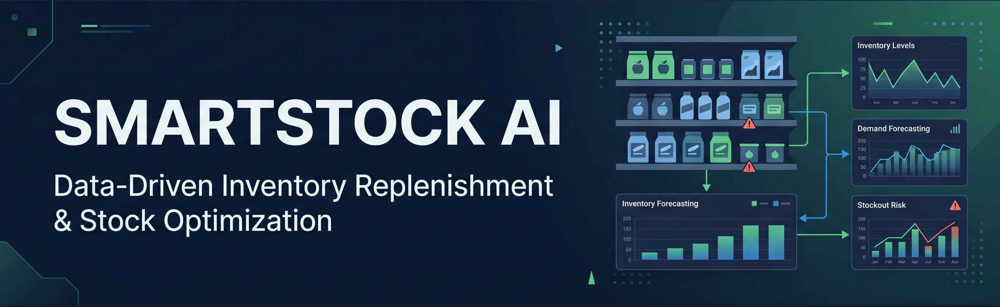

# SmartStock AI

> **Data-Driven Inventory Replenishment & Stock Optimization**

SmartStock AI is a retail inventory analytics and decision-support project.

It uses historical retail data to:

- Analyze sales and demand
- Forecast next-day demand
- Identify stockout risk
- Suggest replenishment quantities
- Support inventory decisions

**Project Flow**

`DATA → ANALYSIS → FORECAST → RISK → REPLENISHMENT → DECISION`

---

## 📌 Problem Statement

Retail stores need to maintain the right amount of inventory.

Low inventory can lead to stockouts and lost sales, while excess inventory can increase waste and costs.

SmartStock AI uses historical data to identify demand patterns, detect inventory risk, and support better replenishment decisions.

---

## 🎯 Objectives

- Analyze historical retail sales
- Understand product and store demand
- Forecast next-day demand
- Identify stockout risk
- Generate replenishment recommendations
- Store new inventory data
- Provide clear business insights

---

## 📊 Datasets

| Dataset | Purpose | Coverage | Main Use |
|---|---|---|---|
| **FreshRetailNet-50K** | Inventory & Demand | 4.5M training records, 50,000 store-product pairs, 898 stores, 865 products, 90 days | Demand forecasting, stockout risk and replenishment |
| **Instacart Market Basket Analysis** | Purchase Behavior | 3.4M orders, 206,209 shoppers, 49,688 products | Purchase and reorder behavior |

**Sources:**

- [FreshRetailNet-50K](https://huggingface.co/datasets/Dingdong-Inc/FreshRetailNet-50K)
- [Instacart Market Basket Analysis](https://www.kaggle.com/datasets/psparks/instacart-market-basket-analysis)
- [FreshRetailNet-50K Research Paper](https://arxiv.org/abs/2505.16319)

> The datasets represent different retail environments and are kept separate.

---

## 🛠️ Technology Stack

| Area | Technology |
|---|---|
| Programming | Python |
| Data Analysis | Pandas, NumPy |
| Database | PostgreSQL |
| Machine Learning | Scikit-Learn |
| Web Application | Streamlit |
| Visualization | Plotly |
| Business Intelligence | Power BI |
| AI Assistant | Google Gemini API |
| Testing | Pytest |
| Version Control | Git & GitHub |

---

## 🔄 How It Works

```text
Retail Data
     ↓
Data Cleaning
     ↓
PostgreSQL
     ↓
Feature Engineering
     ↓
Demand Forecast
     ↓
Stockout Risk
     ↓
Replenishment Recommendation
     ↓
Manager Decision


```markdown
---

## 🚀 Application

SmartStock AI has 8 main pages:

1. **Dashboard** - Overall inventory and demand summary
2. **Products** - Product-level demand, risk and recommendations
3. **Stores** - Store-level performance and risk
4. **Demand & Forecast** - Historical demand and forecast analysis
5. **Inventory Risk** - Products grouped by risk level
6. **Replenishment** - Suggested reorder quantities and decisions
7. **Add Inventory Data** - Add and save new inventory information
8. **AI Inventory Assistant** - Ask questions about project results

---

## 🤖 Machine Learning

A **Random Forest Regressor** is used to forecast next-day demand.

The model uses historical sales, recent demand patterns, stockout history, calendar information, discounts, and weather-related features.

### Model Results

| Metric | Result |
|---|---:|
| MAE | 0.3889 |
| RMSE | 0.6451 |
| R² | 0.8814 |
| MAPE | 53.90% |

A time-based train/test split is used so that future data is not used for earlier predictions.

> MAPE is relatively high because the dataset contains many low and zero-sales observations.


---

## 📦 Replenishment Logic

The project uses predicted demand to create a simple 7-day demand-cover recommendation.

```text
Suggested Reorder Quantity
=
Predicted Demand × 7


### PART 8

```markdown
---

## 🗄️ Database & Cloud Deployment

PostgreSQL is used to store the project's data and results.

The application was developed with local PostgreSQL and deployed using **Neon PostgreSQL**.

The database stores:

- Store and product data
- Historical sales
- Forecast results
- Inventory risk
- Replenishment recommendations
- New inventory updates
- Manager decisions

### Deployment

```text
GitHub
   ↓
Streamlit Community Cloud
   ↓
SmartStock AI
   ↓
Neon PostgreSQL


### PART 9

```markdown
---

## 📊 Power BI

Power BI is used for business reporting and visualization.

The dashboards cover:

- Sales and demand
- Stockout analysis
- Store performance
- Product performance
- Category analysis
- Replenishment insights

---

## 🧪 Testing

The project uses **Pytest** for automated testing.

```bash
pytest -v


### PART 10

```markdown
---

## ⚠️ Limitations

- The main dataset is historical, not live retail data.
- Real-time warehouse inventory is not available.
- Supplier lead times and purchase orders are not included.
- The two datasets are not joined.
- Forecast performance can vary for low and zero-sales products.
- Replenishment results are recommendations, not exact purchase orders.

---

## 💻 Run Locally

```bash
git clone https://github.com/DeepakKumar29th/SmartStock-AI.git
cd SmartStock-AI

python -m venv venv
venv\Scripts\activate

pip install -r requirements.txt

streamlit run streamlit/app.py


### PART 11

```markdown
---

## 📁 Project Structure

```text
SmartStock-AI/
├── data/
├── database/
├── models/
├── python/
├── streamlit/
├── powerbi/
├── tests/
├── docs/
├── requirements.txt
├── README.md
└── .gitignore


### PART 12

```markdown
---

## 🔗 Links

- [SmartStock AI - Personal GitHub](https://github.com/DeepakKumar29th/SmartStock-AI)
- [Sure Trust Data Analytics Repository](https://github.com/sure-trust/DEEPAK-KUMAR-S-g1-data-analytics)

---

## 📚 References

- [FreshRetailNet-50K Dataset](https://huggingface.co/datasets/Dingdong-Inc/FreshRetailNet-50K)
- [FreshRetailNet-50K Research Paper](https://arxiv.org/abs/2505.16319)
- [Instacart Market Basket Analysis Dataset](https://www.kaggle.com/datasets/psparks/instacart-market-basket-analysis)
